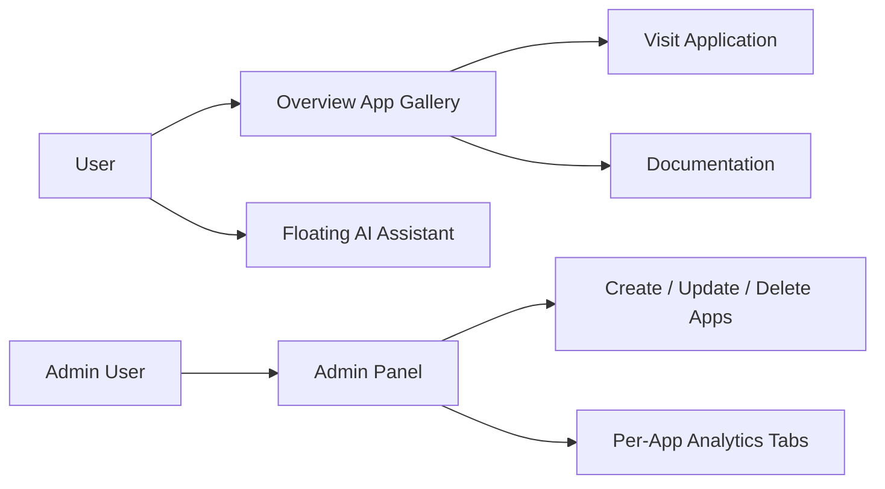
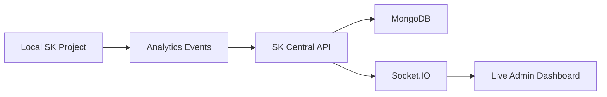
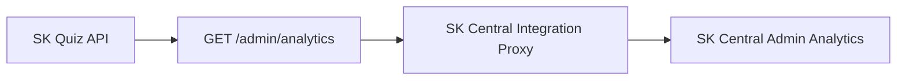

# SK Central

**One Platform. Infinite Possibilities.**

SK Central is a central application ecosystem for launching SK products, reading documentation, managing application metadata, tracking analytics, and using an AI assistant scoped to SK applications and docs.

## Table Of Contents

1. [Overview](#overview)
2. [Purpose](#purpose)
3. [Working](#working)
4. [Core Sections](#core-sections)
5. [Realtime Analytics Flow](#realtime-analytics-flow)
6. [Environment Variables](#environment-variables)
7. [Run Locally](#run-locally)
8. [Flowcharts](#flowcharts)

## Overview

| Area | Details |
| --- | --- |
| Product | SK Central |
| Frontend | React 19, TypeScript, Vite, Tailwind CSS, GSAP |
| Backend | Node.js, Express, MongoDB/Mongoose, Socket.IO |
| Web Port | `5475` |
| API Port | `4002` |
| Main Users | SK users, admins, project owners |
| Main Outcome | One place to launch apps, read docs, manage apps, and track analytics |

## Purpose

SK Central exists to connect multiple SK applications into one usable ecosystem. Users get an attractive application gallery and documentation reader. Admins get application CRUD, analytics tabs per application, and live integration points for local projects such as SK Quiz Coach.

## Working

1. Applications are stored in the SK Central application store.
2. Admin can create, update, delete, and edit application metadata.
3. Documentation uploads support `.md`, `.pdf`, and `.docx` metadata.
4. Overview renders user-facing application cards with live previews.
5. Admin Analytics shows each application in its own tab.
6. SK Quiz realtime analytics can be fetched through `GET /api/integrations/sk-quiz/admin-analytics`.
7. AI assistant calls the backend and uses Gemini when `GEMINI_API_KEY` is set.

## Core Sections

| Section | Purpose |
| --- | --- |
| Overview | User-facing application showcase with preview cards |
| Documentation | Detailed document reader for every application |
| Admin | Application CRUD, analytics, infrastructure, logs, and smart signals |
| Profile | User information, permissions, settings, profile icon, theme, and extra info |
| AI Assistant | Floating assistant scoped to SK applications and documentation |

## Realtime Analytics Flow

SK Central can track other local projects by receiving events or fetching existing admin analytics APIs.

For SK Quiz Coach:

| Item | Value |
| --- | --- |
| Local Project | `C:\Users\Samaksh Rastogi\OneDrive\Desktop\sk-quiz` |
| Source Endpoint | `GET /admin/analytics` |
| SK Central Proxy | `GET /api/integrations/sk-quiz/admin-analytics` |
| Env URL | `SK_QUIZ_API_URL` |
| Optional Token | `SK_QUIZ_ADMIN_TOKEN` |

## Environment Variables

Frontend: `apps/web/.env`

```env
VITE_WEB_PORT=5475
VITE_API_BASE_URL=http://localhost:4002/api
VITE_APP_NAME=SK Central
```

Backend: `apps/api/.env`

```env
NODE_ENV=development
PORT=4002
CLIENT_ORIGIN=http://localhost:5475
MONGODB_URI=mongodb://127.0.0.1:27017/sk-central
JWT_SECRET=development-only
REDIS_URL=redis://127.0.0.1:6379
LOG_LEVEL=info
GEMINI_API_KEY=
GEMINI_MODEL=gemini-1.5-flash
SK_QUIZ_API_URL=http://localhost:4000/api
SK_QUIZ_ADMIN_TOKEN=
```

## Run Locally

```bash
npm install
npm run dev:api
npm run dev:web
```

Open:

```txt
http://localhost:5475
```

API:

```txt
http://localhost:4002/api
```

## Flowcharts

### Platform Flow



### Analytics Flow



### SK Quiz Integration Flow


