<div align="center">

# 🌐 SK Central

### Centralized Identity, Application Governance, and Real-Time Operational Intelligence for the SK Ecosystem

[](https://opensource.org/licenses/MIT)
[](https://nodejs.org/)
[](https://react.dev/)
[](https://www.typescriptlang.org/)
[](https://www.docker.com/)
[](#4-system-architecture)

[Product Overview](#2-product-overview) • [Key Features](#3-key-features) • [System Architecture](#4-system-architecture) • [Engineering Tradeoffs](#5-engineering-decisions--tradeoffs) • [Request Lifecycle](#6-end-to-end-request-lifecycle) • [Security](#10-security--threat-modeling) • [Observability & Reliability](#11-performance-observability--reliability) • [ADRs & Annex](#15-architectural-annex--decision-records-adrs)

</div>

---

## 1. Hero & Executive Summary

**SK Central** is the core control plane and central identity provider (IdP) for the SK application ecosystem. Built to replace fragmented authentication mechanisms, scattered operational logs, and isolated documentation repositories, SK Central delivers a unified, zero-trust Single Sign-On (SSO) architecture alongside a real-time operational dashboard and AI-assisted governance platform.

### Core Capabilities
* **Centralized Identity & SSO**: Single-source-of-truth authentication serving connected downstream applications (*SK Quiz Coach*, *SK MailPilot*, *SK Connect*, *SK MediaFlow*).
* **Application Registry**: Dynamic metadata store and status monitor for all ecosystem micro-applications.
* **Unified Documentation Hub**: Multi-format documentation engine (`.md`, `.pdf`, `.docx`) indexed for instant discovery.
* **Real-time Analytics Pipeline**: Distributed metrics aggregator utilizing Socket.IO and secure service-token proxies.
* **Ecosystem AI Engine**: Context-aware assistant powered by Google Gemini, trained on workspace documentation and application state.

---

## 2. Product Overview

### The Problem
As modern software ecosystems expand into micro-services and micro-frontends, engineering teams suffer from:
1. **Authentication Fragmentation**: Re-implementing auth logic, session management, and access control in every service.
2. **Operational Blindspots**: Lacking a single pane of glass to observe cross-application metrics, health, and activity logs.
3. **Information Silos**: Documentation buried in separate repositories without centralized search or AI context indexing.
4. **Poor Developer Onboarding**: High complexity when integrating new products into existing identity and telemetry pipelines.

### The Solution
**SK Central** introduces a unified governance layer that acts as the platform backbone:

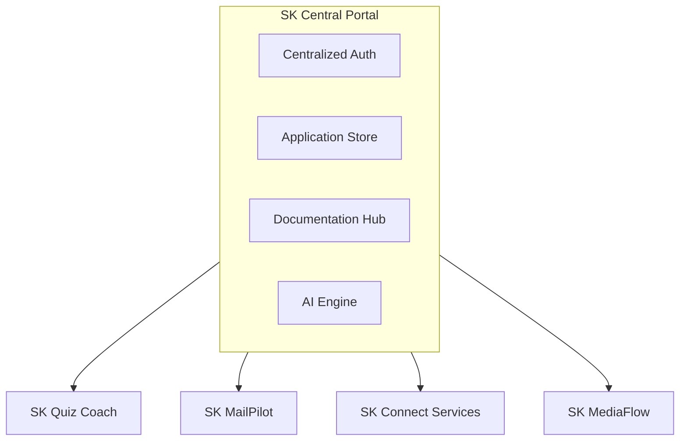

### Persona Breakdown

| Persona | Primary Capabilities | Technical Value |
| :--- | :--- | :--- |
| **End Users** | Seamless SSO across apps, unified profile, integrated documentation reader, AI assistant. | Eliminates login fatigue, provides instant answers via AI, centralizes navigation. |
| **Administrators** | App registry management, real-time log tailing, cross-app metrics, global session revocation. | Provides immediate visibility into service health, user access, and system telemetry. |
| **Integrators / Developers** | Standardized SSO protocols, proxy endpoints, event streaming schemas, Docker setup. | Reduces app onboarding time from days to minutes with zero-trust token handshakes. |

---

## 3. Key Features

<details open>
<summary><b>🔒 Authentication & Identity (SSO)</b></summary>

* **Single Sign-On (IdP)**: Central session management utilizing secure HttpOnly cookies (`sk_central_sid`).
* **Short-Lived Signed Tokens**: Generates app-scoped, signed JWTs for downstream APIs without sharing master session secrets.
* **Global Session Revocation**: Instantly invalidates user sessions across all connected products from a central trigger.
</details>

<details open>
<summary><b>📦 Application Registry & Management</b></summary>

* **Dynamic CRUD Store**: Register, edit, and categorize ecosystem products with custom metadata (status, routes).
* **Live Status Monitoring**: Real-time heartbeat detection and status broadcasting via WebSockets.
</details>

<details open>
<summary><b>📚 Unified Documentation Hub</b></summary>

* **Multi-Format Parsing**: Built-in support for rendering `.md`, `.pdf`, and `.docx` technical documentation.
* **Indexed Search**: Unified search engine querying documentation text across all connected products.
</details>

<details open>
<summary><b>📊 Operational Analytics & Metrics</b></summary>

* **Secure Proxy Aggregation**: Polls protected, aggregate-only downstream APIs using shared service tokens.
* **Real-time Event Streaming**: Pushes incoming metrics directly to live administrative charts over WebSockets.
</details>

<details open>
<summary><b>🤖 Context-Aware AI Intelligence</b></summary>

* **Gemini Model Integration**: Powered by Google Gemini (`gemini-3.5-flash`) for ecosystem-aware assistance.
* **Document RAG Prompting**: Automatically injects relevant app metadata and docs into AI context windows.
</details>

<details open>
<summary><b>⚡ Real-Time Infrastructure</b></summary>

* **Socket.IO Event Bus**: Low-latency bi-directional communication for logs, activity feeds, and catalog updates.
* **State Synchronization**: Keeps client tabs synchronized across multiple browser windows.
</details>

---

## 4. System Architecture

### 4.1 High-Level Architecture Topology

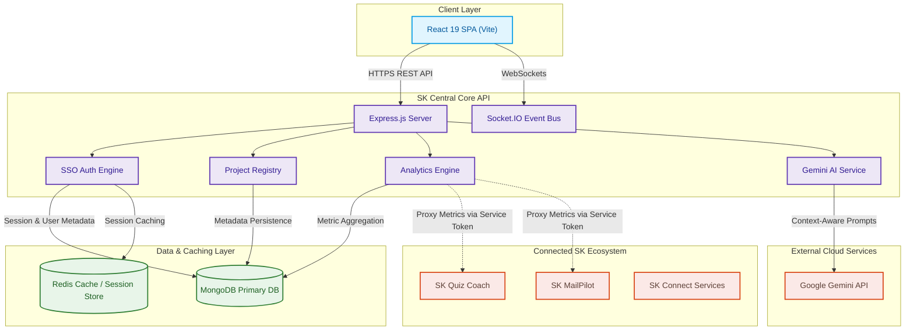

#### Engineering Explanation & Rationale
* **Decoupled Gateway Model**: SK Central separates web delivery (React SPA) from core domain services (Express API), enabling independent horizontal scaling and distinct security perimeters.
* **Hybrid Storage Architecture**: Persistent operational data resides in MongoDB, while transient high-concurrency state (sessions, rate-limiting counters) lives in Redis for sub-millisecond lookups.

---

### 4.2 Core Architecture & Platform Principles

SK Central is built upon five foundational system design principles:

1. **Stateless Compute**: API instances maintain no sticky local state. All active sessions, rate-limit counters, and broadcast subscriptions reside in Redis, allowing API workers to scale horizontally behind a load balancer.
2. **Zero-Trust Token Handshaking**: Master authentication secret (`sk_central_sid`) never leaves the SK Central security perimeter. Downstream applications only receive short-lived, asymmetric JWTs scoped to their specific `appId`.
3. **Eventual Consistency for Telemetry**: Telemetry ingestion uses asynchronous logging pipelines. Non-critical metric writes never block user-facing authentication or database operations.
4. **Contract-First Service Proxying**: Inter-service communication relies on rigid environment-level secret tokens and deterministic JSON header schemas.
5. **Fault Isolation & Graceful Degradation**: External API polling failures (e.g., if *SK Quiz* goes offline) are trapped by circuit-breaking proxies, preventing cascading failures in the primary dashboard.

---

### 4.3 Design Patterns Applied

| Pattern | Architectural Component | Purpose & Implementation |
| :--- | :--- | :--- |
| **Identity Provider (IdP) / Token Exchange** | `AuthService` | Centralized identity management where central sessions are exchanged for app-scoped signed JWTs. |
| **API Gateway / Integration Proxy** | `IntegrationRoutes` & `ProxyService` | Unifies downstream REST APIs under a single domain (`/api/integrations/*`), stripping sensitive authorization headers before forwarding. |
| **Pub/Sub Event Bus** | `SocketServer` & Redis Adapter | Broadcasts application updates and real-time logs across N stateless API instances using Redis Pub/Sub channels. |
| **Repository / Data Access Layer (DAL)** | `Repositories` | Encapsulates Mongoose database operations, decoupling business controllers from ODM implementations. |
| **Defense-in-Depth Middleware Pipeline** | `ExpressApp` | Sequenced execution of Helmet security headers, CORS origin verification, IP rate-limiting, and JWT validation. |
| **RAG (Retrieval-Augmented Generation)** | `AIService` | Dynamically fetches Markdown application metadata and injects it into Gemini prompt context windows. |

---

### 4.4 Authentication & SSO Architecture

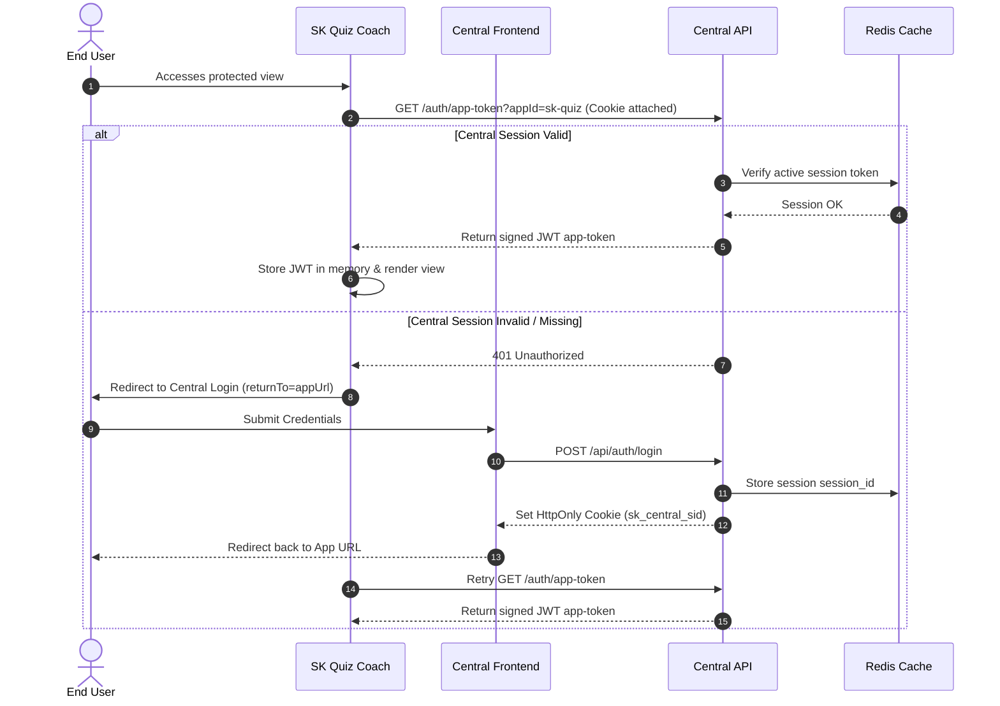

---

### 4.5 Application Registration & Sync Flow

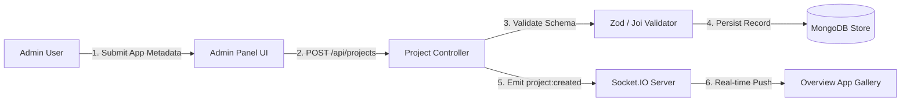

---

### 4.6 Analytics Aggregation Pipeline

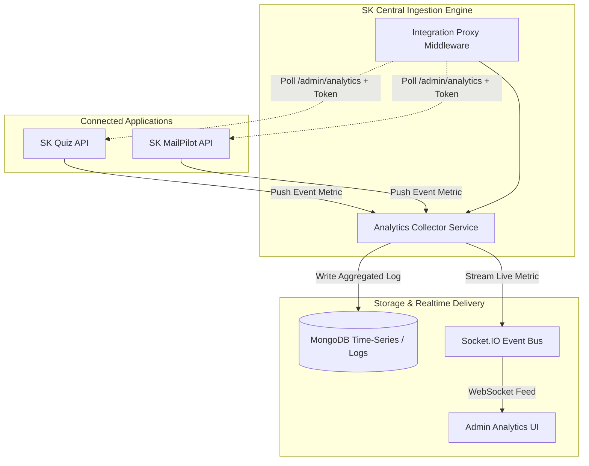

---

## 5. Engineering Decisions & Tradeoffs

| Technology | Selection Rationale | Considered Alternatives | Key Tradeoffs / Mitigations |
| :--- | :--- | :--- | :--- |
| **React 19 + Vite** | Fast HMR, optimized production bundles, modern concurrent rendering features for smooth UI transitions. | Next.js, Remix | SPA architectural simplicity chosen over SSR; initial bundle footprint minimized via code splitting and dynamic imports. |
| **Express.js (Node)** | Battle-tested middleware ecosystem, low latency I/O, rapid route handling, seamless TypeScript support. | NestJS, Fastify | Fastify offers higher raw throughput, but Express provided immediate compatibility with existing custom middlewares. |
| **MongoDB + Mongoose** | Flexible JSON document model ideal for heterogeneous application metadata, logs, and user identity profiles. | PostgreSQL | Relational integrity handled at application service boundaries; indexing optimized for frequent read operations. |
| **Redis** | In-memory latency (<1ms) for session validation, API rate limiting, and pub/sub messaging. | Memcached, In-Memory Node Map | Introduces additional infrastructure component; mitigated via Docker orchestration and connection fallback handlers. |
| **Socket.IO** | Automatic transport fallback (WebSocket to HTTP long-polling), built-in reconnection management, room isolation. | Raw WebSockets, Server-Sent Events (SSE) | Higher frame overhead than raw WS; chosen for client resilience across varied network environments. |
| **Google Gemini API** | Large context window support, high reasoning capabilities for technical documentation analysis, cost-effective inference. | OpenAI GPT-4o, Anthropic Claude | External network latency mitigated by asynchronous backend processing and streaming responses. |
| **Docker** | Consistent build environment across development, testing, and production deployments. | Bare-metal PM2 | Slight resource containerization overhead; offset by reproducible zero-dependency setup. |

### Architectural Deep Dives & Interview Insights

#### Why Central Session Cookies + Signed App JWTs?
A common architecture trap is issuing a single global JWT directly to client browsers. If compromised, a global JWT allows adversaries to impersonate users across every ecosystem app until expiration. SK Central mitigates this by keeping the master session secret inside an `HttpOnly`, `SameSite` cookie managed exclusively by Central. Downstream apps receive signed, short-lived (15-minute) asymmetric JWTs scoped strictly to their `appId`.

#### Why Dual-Store (MongoDB + Redis) instead of Single DB?
Relying solely on MongoDB for high-frequency session lookups and rate-limiting counters introduces significant read amplification and DB lock contention. Redis provides sub-millisecond in-memory lookups (`O(1)` complexity). Conversely, storing complex relational app catalogs and historical analytics in Redis would exhaust expensive RAM. The hybrid model pairs MongoDB's rich query indexing with Redis's memory performance.

---

## 6. End-to-End Request Lifecycle

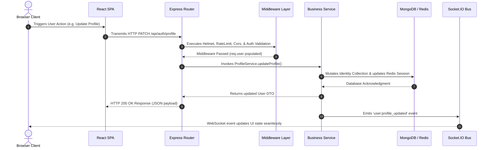

---

## 7. Data Flow Architecture

### 7.1 Data Flow Matrix

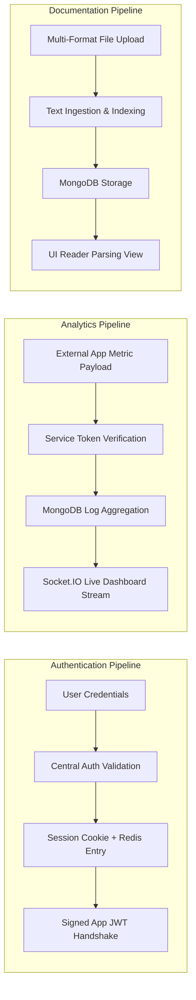

---

## 8. Folder Structure & Monorepo Organization

```
SK-Central/
├── apps/
│   ├── api/                      # Core Express Backend Service
│   │   ├── src/
│   │   │   ├── config/           # Environment, CORS, and Redis configs
│   │   │   ├── constants/        # System-wide constants & enums
│   │   │   ├── controllers/      # HTTP Request handlers
│   │   │   ├── database/         # MongoDB connection & migration helpers
│   │   │   ├── middlewares/      # Security, Auth, Rate Limiting, Error handling
│   │   │   ├── models/           # Mongoose schemas (Identity, Project, Log, Analytics)
│   │   │   ├── repositories/     # Data Access Layer (DAL)
│   │   │   ├── routes/           # Domain-driven API route definitions
│   │   │   ├── services/         # Business logic layer (SSO, Gemini, Proxy)
│   │   │   ├── socket/           # Socket.IO handlers and event definitions
│   │   │   ├── utils/            # Shared loggers, formatters, and crypto utilities
│   │   │   └── validators/       # Input payload validation schemas
│   │   ├── .env.example          # API environment template
│   │   └── package.json
│   │
│   └── web/                      # Frontend React SPA Client
│       ├── src/
│       │   ├── components/       # Reusable UI components & animations
│       │   ├── constants/        # Client routing and API endpoints
        ├── src/layouts/          # Dashboard & Public page frames
        ├── src/pages/            # Page Views (Overview, Admin, Docs, Profile, Analytics)
        ├── src/routes/           # Protected & Public React Router routes
        ├── src/services/         # Axios API clients & WebSocket managers
        ├── src/store/            # State management (Global Auth, App catalog)
        └── src/styles/           # Tailwind CSS & custom design tokens
```

---

## 9. API Specification Overview

For full API endpoint documentation, query the `/api` route after initializing the server.

### Major API Modules

| Module | Base Path | Core Responsibilities | Key Endpoints |
| :--- | :--- | :--- | :--- |
| **Auth & SSO** | `/api/auth` | User login, session management, SSO app-token issuance, global logout. | `POST /login`, `GET /me`, `GET /app-token`, `POST /global-logout` |
| **Projects & Registry**| `/api/projects` | Ecosystem app registration, status management, metadata CRUD, docs retrieval. | `GET /`, `POST /`, `GET /:id`, `GET /:id/docs` |
| **Analytics Proxy** | `/api/integrations` | External app metric proxies and telemetry collection. | `GET /sk-quiz/admin-analytics`, `POST /telemetry` |
| **AI Assistant** | `/api/ai` | Gemini-powered assistant queries enriched with document context. | `POST /query`, `GET /history` |
| **Administration** | `/api/admin` | System health checks, live log streams, metric overviews, user management. | `GET /system-health`, `GET /logs`, `DELETE /users/:id` |

---

## 10. Security & Threat Modeling

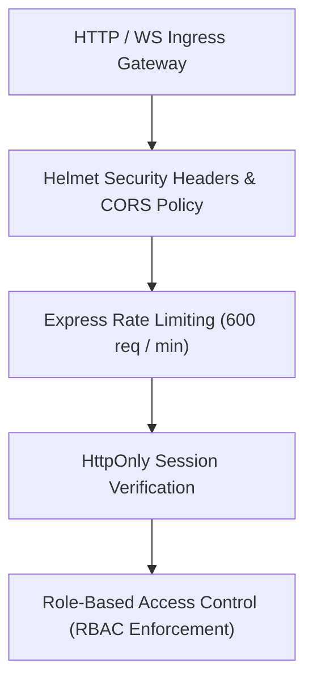

### Security & Threat Mitigation Matrix

| Threat Vector | Severity | Architectural Mitigation Strategy |
| :--- | :--- | :--- |
| **Cross-Site Scripting (XSS)** | High | Session token is set as `HttpOnly`, preventing JavaScript access. Content Security Policy (CSP) enforced via `Helmet`. |
| **Cross-Site Request Forgery (CSRF)** | High | Strict `SameSite=Lax/Strict` cookie enforcement paired with origin verification in CORS middleware. |
| **Token Replay Attacks** | Medium | Downstream JWT app-tokens have asymmetric cryptographic signatures and short expiration windows (15 minutes). |
| **Credential Brute-Force & Denial-of-Service** | High | Redis-backed sliding window rate-limiting middleware restricting traffic to 600 requests/min per IP. |
| **Rogue Service Integration** | Critical | Integration proxy requires pre-shared symmetric secret handshakes before proxying aggregate metrics. |

---

## 11. Performance, Observability & Reliability

### 11.1 Performance Optimization
* **Multi-Tier Caching**: High-frequency metadata and session states are cached in Redis to prevent database bottlenecks.
* **WebSocket Room Separation**: Real-time traffic uses binary framing and room isolation (`socket.join('admin-room')`) to eliminate unnecessary event broadcasts.
* **Frontend Code Splitting**: Route-based dynamic imports via `React.lazy()` keep initial JavaScript bundles under 150KB gzip.
* **Database Compound Indexing**: MongoDB indexes (`{ userId: 1, createdAt: -1 }`, `{ appId: 1 }`) ensure query execution plans remain `IXSCAN` rather than `COLLSCAN`.

### 11.2 Observability & Telemetry Probes
* **Health Check Probes**: Exposes `GET /api/health` (liveness) and `GET /api/system/health` (readiness check evaluating MongoDB and Redis connection ping status).
* **Structured Tracing**: Middleware injects a unique request correlation ID (`X-Request-ID`) into HTTP headers and Morgan logging streams for end-to-end request tracing.
* **Stream Log Management**: Log output formatted as structured JSON for easy ingestion into Grafana Loki, Datadog, or ELK stacks.

### 11.3 Reliability & Fault Tolerance
* **Integration Circuit Breaking**: External API calls via the Integration Proxy set strict 3-second timeouts. Downstream outages in connected apps (*SK Quiz*) fail fast without blocking Express worker threads.
* **Socket Reconnection Backoff**: Socket.IO client utilizes exponential backoff with randomized jitter (`reconnectionDelayMax: 5000`) to prevent thundering herd recovery attempts.
* **Graceful Worker Shutdown**: Process signals (`SIGTERM`, `SIGINT`) trigger a teardown sequence that drains HTTP connections, closes WebSocket rooms, and flushes database connection pools cleanly.

---

## 12. Scalability & Ecosystem Integration

SK Central is designed for **zero-code-change app onboarding**. Adding a new application (e.g., *SK Connect*) to the ecosystem requires no architectural modifications in SK Central.

### Onboarding Steps for New Applications
1. **Register Application**: Add application metadata via the SK Central Admin UI (`/admin`).
2. **Configure SSO Handshake**: Add SK Central app-token endpoint verification in the downstream app backend.
3. **Set Shared Service Secrets**: Configure symmetric service tokens in downstream environment settings for aggregate metric proxying.

```
+------------------+     Shared Secret Token     +------------------+
|  SK Central API  | <-------------------------> |  New SK App API  |
+------------------+                             +------------------+
```

### 12.1 Multi-Node Horizontal Scaling Blueprint

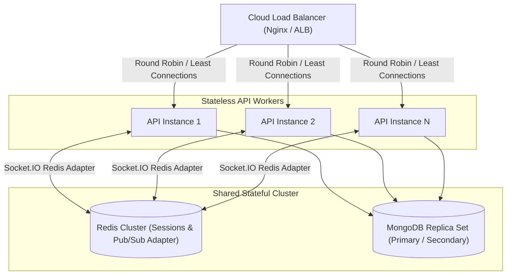

---

## 13. Future Roadmap

- [x] **Phase 1: Core Foundation (Completed)**
  - Single Sign-On identity provider implementation.
  - Basic application catalog and documentation reader.
- [x] **Phase 2: Analytics & AI Engine (Current)**
  - Integration proxy for connected app analytics.
  - Context-aware Google Gemini assistant integration.
  - Real-time Socket.IO operational stream.
- [ ] **Phase 3: Advanced Governance (Q4 2026)**
  - WebAuthn / FIDO2 Passwordless authentication.
  - OpenID Connect (OIDC) compliant endpoint suite.
  - Multi-tenant workspace isolation.

---


## 14. Production Deployment Topology

### 14.1 Enterprise Cloud Deployment Architecture

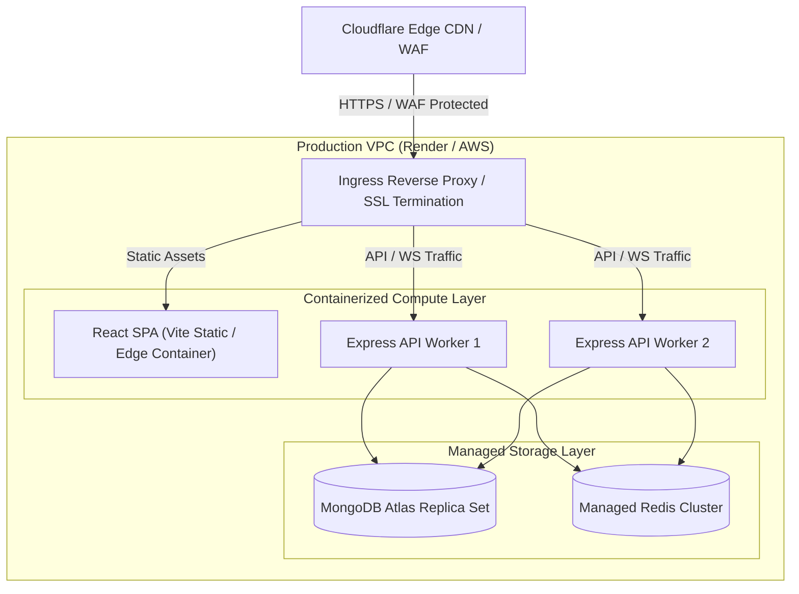

---

## 15. Architectural Annex & Decision Records (ADRs)

### 15.1 Architecture Decision Records (ADRs)

#### ADR-001: Centralized Identity Provider (IdP) Pattern over Distributed Authentication
* **Status**: Accepted
* **Context**: Individual microservices in the SK ecosystem previously implemented separate authentication schemas, creating session fragmentation, duplicate credential stores, and poor user onboarding.
* **Decision**: Adopt a centralized IdP model where SK Central owns user identities and session states (`sk_central_sid` HttpOnly cookies). Connected apps receive short-lived (15-min) signed JWT app-tokens via `/api/auth/app-token`.
* **Consequences**: Downstream apps eliminate auth logic; compromise of an individual downstream app token does not compromise master user sessions.

#### ADR-002: Dual-Store Strategy (MongoDB for Schema Flexibility, Redis for Latency)
* **Status**: Accepted
* **Context**: Storing high-frequency sliding-window rate limit counters and volatile user sessions in MongoDB caused lock contention and read amplification.
* **Decision**: Use Redis for `O(1)` session verification and rate limiting, while using MongoDB for structured application registries, documentation schemas, and historical logs.
* **Consequences**: Sub-millisecond auth latency (<1ms Redis lookup); MongoDB resources preserved for complex analytical queries.

#### ADR-003: Socket.IO with Redis Adapter for WebSocket Scalability
* **Status**: Accepted
* **Context**: Native WebSockets or single-instance Socket.IO servers break when scaling horizontally across multiple API server containers behind a load balancer.
* **Decision**: Implement Socket.IO paired with `@socket.io/redis-adapter` for pub/sub event distribution across stateless worker processes.
* **Consequences**: API instances scale horizontally without losing real-time event synchronization across client browser tabs.

#### ADR-004: Service-Token Integration Proxy for Connected App Telemetry
* **Status**: Accepted
* **Context**: Connected applications (*SK Quiz*, *SK MailPilot*) run as independent services with protected admin analytics endpoints.
* **Decision**: Implement an Integration Proxy in SK Central that authenticates against downstream APIs using a pre-shared symmetric token.
* **Consequences**: Prevents exposure of raw app databases to SK Central while maintaining unified real-time operational dashboard visibility.

#### ADR-005: RAG Context Augmentation with Google Gemini 3.5 Flash
* **Status**: Accepted
* **Context**: Generic LLM assistants lack specific awareness of SK ecosystem routes, documentation, and product capabilities.
* **Decision**: Implement a Retrieval-Augmented Generation (RAG) context injector that dynamically fetches project metadata and Markdown documentation prior to dispatching queries to Google Gemini.
* **Consequences**: AI responses are contextually accurate to the SK workspace; network cost and token limits managed via context truncation filters.

---

### 15.2 Quality Attributes & Non-Functional Requirements (NFRs)

| Quality Attribute | Target Metric | Architectural Mechanism |
| :--- | :--- | :--- |
| **Availability** | 99.9% Uptime | Stateless Express API containers, automated health probes, database connection pooling. |
| **Performance** | < 50ms Auth Latency | In-memory Redis session verification, dynamic bundle code-splitting via React/Vite. |
| **Security** | Zero-Trust Session Isolation | HttpOnly SameSite cookies, asymmetric short-lived JWT app tokens, Helmet security headers. |
| **Reliability** | Fault Isolation | 3-second circuit breaker timeouts on integration proxies; non-blocking log ingestion pipelines. |
| **Scalability** | Horizontal Worker Scale | Redis Pub/Sub adapter for Socket.IO event broadcasting across N stateless containers. |
| **Maintainability** | Clean Layered Monorepo | Strict separation between Routes, Controllers, Services, Repositories, and Mongoose Models. |
| **Observability** | End-to-End Tracing | Structured JSON logging with Winston/Morgan, correlation request IDs (`X-Request-ID`). |

---

### 15.3 Failure Scenarios & Graceful Degradation Matrix

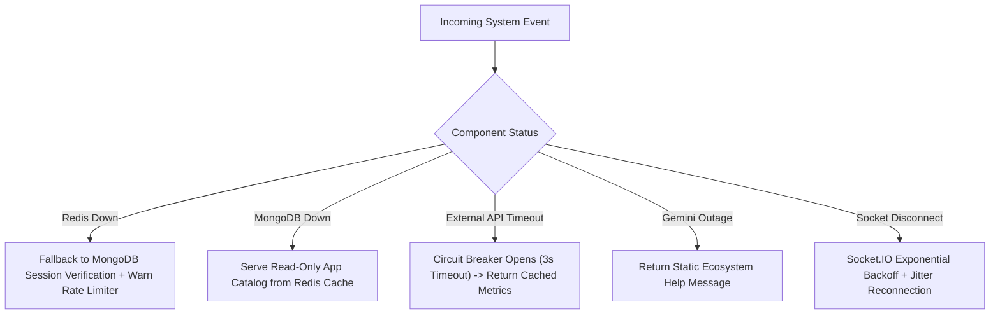

| Failure Scenario | Impact Level | Degradation Strategy / Recovery Protocol |
| :--- | :--- | :--- |
| **Redis Cache Outage** | Medium | Fall back to direct MongoDB session verification. Rate-limiting degrades to un-cached fallback mode. Log alert dispatched. |
| **MongoDB Database Disconnection** | Critical | Serve cached application catalog and active session states from Redis in read-only mode. Buffer log writes in memory queue. |
| **External App API Timeout (SK Quiz)** | Low | Integration proxy circuit-breaker triggers after 3s. Dashboard displays last known cached metrics with a stale indicator. |
| **Google Gemini API Outage** | Low | AI Assistant widget gracefully returns a standard ecosystem help fallback without crashing the portal UI. |
| **WebSocket Connection Loss** | Low | Client auto-reconnects using exponential backoff with randomized jitter (`reconnectionDelayMax: 5000`); falls back to HTTP polling. |

---

### 15.4 Component Responsibility & Impact Matrix

| Component | Core Responsibility | Upstream / Downstream Dependencies | Failure Impact |
| :--- | :--- | :--- | :--- |
| **AuthService** | User authentication, session management, SSO JWT issuance | MongoDB (`Identity`), Redis | High: Users cannot log in or request new app-tokens. |
| **ProjectService** | Application catalog CRUD, documentation indexing | MongoDB (`Project`), SocketServer | Medium: Cannot register new apps or update docs metadata. |
| **AnalyticsService** | Proxying aggregate metrics, event log collection | External App APIs, SocketServer | Low: Operational charts fail to refresh live. |
| **AIService** | Context-augmented LLM prompt dispatching | Google Gemini API, ProjectService | Low: AI Assistant becomes temporarily unavailable. |
| **SocketServer** | Real-time WebSocket event broadcasting | Redis Pub/Sub Adapter, Web Client | Low: UI requires manual page refresh for catalog updates. |

---

### 15.5 Hardest Engineering Challenges Solved

#### Challenge 1: Cross-Domain Session Isolation without Exposing Master Credentials
* **Problem**: Downstream applications (*SK Quiz*, *SK MailPilot*) needed seamless SSO authentication without having access to Central's master session secret or database.
* **Decision**: Built a double-ring token exchange architecture. Master sessions are sealed inside `HttpOnly` cookies (`sk_central_sid`). Downstream apps receive signed, short-lived (15-min) asymmetric JWT app-tokens via `/api/auth/app-token?appId=<appId>`.
* **Tradeoff**: Adds one extra network hop during initial app loading.
* **Outcome**: Complete zero-trust security isolation; compromise of a downstream app token cannot compromise Central's identity store.

#### Challenge 2: Multi-Node Real-Time Synchronization
* **Problem**: Scaling Express backend instances across container clusters caused WebSocket users connected to Instance A to miss catalog/metric events emitted on Instance B.
* **Decision**: Integrated `@socket.io/redis-adapter` to turn Redis into a centralized pub/sub transport bus for all socket broadcasts.
* **Tradeoff**: Slight memory overhead on Redis for message queues.
* **Outcome**: Stateless API containers scale horizontally to N instances while maintaining perfect real-time UI synchronization.

---

### 15.6 Future Architecture Evolution

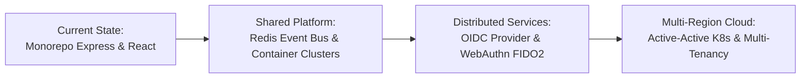

---

## 16. License

Distributed under the MIT License. See `LICENSE` for more information.

---

<div align="center">
  <sub>Built with precision for the SK Application Ecosystem. Designed & Maintained by the SK Engineering Team.</sub>
</div>
